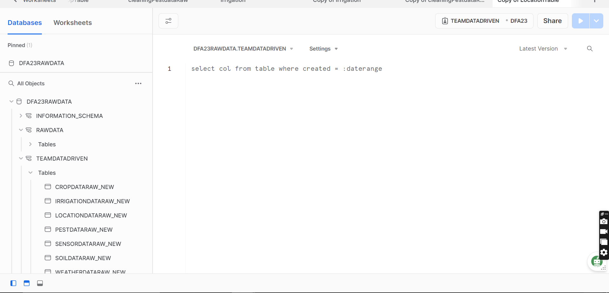
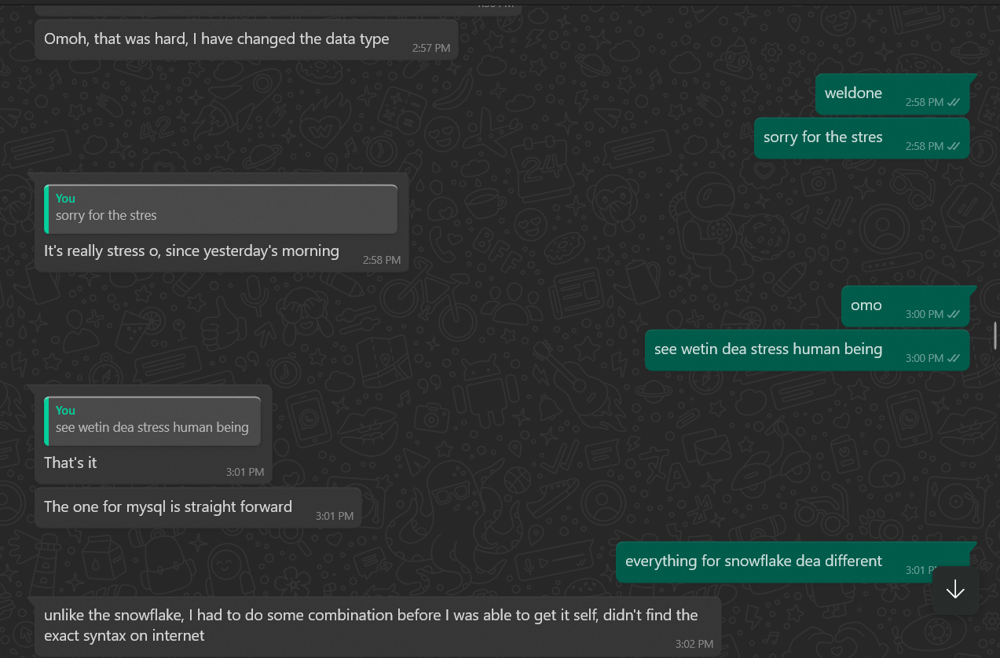

# Data Engineer project for DAF23 Datathon (Snowflake)

Omo, how should I even start this documentation, I am pouring my frustration into this report, but at the same time, you will be learning how I handled the problems and provided my best solution.

## How it started

**Datafest Africa** is a data community for data professionals and enthusiasts dedicated to building data solutions with innovative tools.

Every year, Data Fest brings together data professionals from all over Africa into one place to organize an event where they invite speakers to discuss several data-related topics.

As I am writing this, we are preparing for Datafest Africa 2023 in Lagos. You can get your ticket [here](https://tix.africa/datafest23).

During this event process, a hackathon, also known as a datathon, will commence. This year's datathon consists of three data professionals in a team (Data analyst, Data scientist, and Data engineer).

The aim is to showcase collaboration, problem-solving, and innovative solutions through analyzing and drawing conclusions from the provided datasets.

### Prizes to Win
* First Prize: $1,200 Cash price
* Second Prize: $1,000 Cash price
* Third Prize: $800 Cash price

So as a **data analyst**, I met with a friend of mine who is a data scientist, and we agreed to form a team and register as “**_Team Data-Driven_**” However, we needed to find a data engineer, so she sourced for one and got someone to join our team. We registered, and on Friday, September 15, 2023, at 12 a.m., the datathon began as we received an email with information on how we were going to participate in the hackathon.

The competition is happening on **Dicey Tech**, a skills platform where you can access AI and data projects, build your portfolio, grow your network, and discover perfect-fit jobs.

The data engineer and data analyst information and dataset data came first, as the data analyst challenge will come later. So in the WhatsApp group we created, we communicated, and everyone registered on the Dicey Tech website to enroll and access the data. I went through the data engineer and data scientist projects, and that’s where the problem started ghen ghen.

After checking it out, our data engineer came back to say he does not know how to use the tools that were introduced in the project “**Snowflake**”. The snowflake is where the data engineer will perform tasks such as Data ingestion, schema setup, data cleaning, transformation, and model creation.

The raw data is already available on Snowflake just for the engineer to start his task, but he said he cannot use Snowflake because Snowflake Data Warehouse uses SQL, and he cannot write SQL.

The dataset is real-time agricultural sensor data. To have a better understanding of the project, kindly click [here](https://portfolio.diceytech.co.uk/project-opportunity/1694538398348x655935314959794200) to read more

## What is Snowflake?

The Snowflake Data Cloud includes a pure cloud SQL data warehouse from the ground up. Designed with a patented new architecture to handle all aspects of data and analytics, it combines high performance, high concurrency, simplicity, and affordability at levels not possible with other data warehouses.

As a data analyst, I can write sequels, so I took the project upon myself, and that is where the frustration started.

## The Pain 101

I went through the task and enrolled as a data engineer, and we were given logins and a link to Snowflake. I logged into Snowflake and did not even understand anything 😂😂🤣

But something that makes it interesting and quite easy to quickly understand the platform is its new interface. I immediately saw the SQL worksheet, and I knew that was where I would write my queries.

## The Raw Data

As I said earlier, a database has been created, and the dataset is already available on Snowflake with an empty schema named “**TEAM DATA DRIVEN**.”

I tried to run a query on the dataset, and it worked perfectly, but I can't perform any manipulation on the dataset because it shows “_SQL access control error:
Insufficient privileges to operate on the table_”. It means I don't have full access to the raw data

All these were on Friday at midnight, so I went to sleep because my laptop was low already.

In the morning, I began my journey to find out how I was going to gain access to the raw data. I sent an email to the support, but there was no quick response. I went to Datafest Discord, but I couldn't understand what they were saying, so I continued with my research to find out if I needed to duplicate the data into the empty team schema.

## Data Preparation

I contacted a friend of mine on Twitter, known as Rukayat Rauf, who is also a data analyst, for help when I couldn't understand anything earlier. She also can't use Snowflake, so I have to carry my cross, but she promised to provide support.

After spending time figuring out how to get my data out of raw data and being able to start my data cleaning, I used the below code to copy my table from raw data into **TEAM DATA-DRIVEN**

### Copy or Duplicate tables with records from an existing table

Create Table weatherdataraw_NEW AS SELECT*

FROM DFA23RAWDATA.RAWDATA.weatherdataraw

The above query with the select statement and “*” creates a new table and copies the columns and rows into it

Note: There are some differences in the syntax of snowflake dialects compared to other RDMS. which is a big problem because I need to research how to write some queries in snowflake

_This thing took my time and stressed me sha..…_

## Dataset

The dataset contains Seven tables with an average of 1.7 million rows per table

Tables:
* Sensor Data Table
* Weather Data Table
* Soil Data Table
* Crop Data Table
* Irrigation Data Table
* Location Data Table
* Pest Data Table

## Data Transformation

My friend, **Rukayat**, helped me with the assessment of the dataset by checking each table to find what data cleaning process the data in the table needs and writing it as a comment in the query

To avoid wasting time, since the data assessment process is similar across all tables, I will be sharing two table assessment queries.

The Sensor data table assessment: contains only numerical values

SELECT * FROM sensordataraw_new; -- contains 7 columns and 1,

_Check if the Sensor ID column contains null values_

SELECT sensor_id, COUNT(sensor_id) 
FROM sensordataraw_new
GROUP BY sensor_id
HAVING COUNT(sensor_id)> 1;

SELECT *  _contains character "" and need to be removed_
FROM sensordataraw_new
WHERE sensor_id = 'NA';  _there are no null values_

_Assessing the Timestamp column (Incorrect datatype, contains character "" and need to be removed)_

SELECT *
FROM sensordataraw_new
WHERE timestamp is NULL; _no null rows, no empty rows and no NAs _

_Assessing the Temperature column (Incorrect data type, change to decimal)_

SELECT *
FROM sensordataraw_new
WHERE temperature = 'NA'; _no null rows, no empty rows but contains 239,741 NAs_

_Assessing the Humidity column (Incorrect data type, change to decimal)_

SELECT *
FROM sensordataraw_new
WHERE humidity  = 'NA';  _no null rows, no empty rows but contains 239,972 NAs_

_Assessing the light_intensity column (Incorrect data type, change to decimal)_

SELECT *
FROM sensordataraw_new
WHERE light_intensity  = 'NA'; _no null rows, no empty rows but contains 240,239 NAs_

_Assessing the battery_level column (Incorrect data type, change to decimal)_

SELECT *
FROM sensordataraw_new
WHERE battery_level = 'NA'; _column is okay, no null rows, no empty,no NAs_

**Data cleaning for this table**

1. Remove the "" from the sensor_id column
2. Remove the "" from the timestamp and  Change the data type to the datetime
3. Replace the NA in the Temperature, Humidity, Soil_moisture and light_intensity columnns with the mean, median or mode  and change their datatypes to decimal

The Weather data table contains both categorical and numerical data

_Assess the timestamp column (Incorrect data type)_

SELECT * FROM weatherdataraw_new
WHERE TIMESTAMP is null; _511,502 columns are null, delete all rows where the timestamp is null_

_Assess the columns with no data_

SELECT * FROM weatherdataraw_new
WHERE weather_condition = 'NA' And wind_speed = 'NA' AND precipitation = 'NA'; _4175 rows has no data in weather_condition, wind_speed and Precipitation.. Delete them_

_Assess the weather_condition column_

SELECT * FROM weatherdataraw_new
WHERE weather_condition = 'NA'; _511,502 columns are null, 419,683 are NA delete all rows where timestamp is null_

SELECT DISTINCT(weather_condition), COUNT(weather_condition)
FROM weatherdataraw_new
GROUP BY weather_condition; _Clear was misspelled as Claar and needs to be changed to Clear, there are 20,703 of them_

_Assess the wind_speed column (change the data type to decimal after dealing with the NA rows)_

SELECT * 
FROM weatherdataraw_new
WHERE wind_speed is null; _511,502 columns are null, 210,148 are NA, no empty rows_

_Assess the precipitation column (change the data type to decimal after dealing with the NA rows)_

SELECT * 
FROM weatherdataraw_new
WHERE precipitation = 'NA'; _511,502 columns are null, 209,703 are NA, no empty rows_

---
Moving on, As she was assessing it, I was performing the cleaning.

I faced some challenges doing the cleaning because, like I said earlier, some syntax is actually operating differently on Snowflake

## Data Type yawa (problem in english)

I encountered an issue when I was trying to change my first cleaning table datatype. All the column datatypes were in **VARCHAR (16777216)**, which is the snowflake maximum character. So, it means I will be changing all column datatypes in each column, whether they are correct or not.

The tables also contain a timestamp column, which also gave me a tough time

Changing data type is very different in Snowflake, as you can't just update or alter the table, especially for changing data type

After cleaning my first table (code below), I tried to change the data by using the normal SQL server ALTER TABLE statement, but it didn't work.

Alter Table Cropdataraw_new
Alter Column Crop_yield Decimal(8, 2);

I kept on having the below error.

_Snowflake SQL compilation error: cannot change a column from type Varchar to Decimal_

I researched what was happening, and then I realized that Snowflake does not automatically know how to make data conversions, so the options to change data types are not full.

I found a video on **VCKLY Tech** YouTube channel that teaches how to resolve the “Cannot change column" error in Snowflake. Check it out [here](https://www.youtube.com/watch?v=z4lRX0ord9c)

The video tutorial helped me solve other column datatype issues except the **timestamp column and timestamp datatype**.

> [!IMPORTANT]
You Will find all the codes I used below

I have another difficult challenge changing the **Timestamp** column datatype from varchar to timestamp. Yes, I should use the same method with others, but it doesn't work because the date format is not the same as the timestamp datatype format. 

The timestamp column date format is _dd-mm-yyyy_ while the timestamp datatype is _yyyy-mm-dd_ so I need to do a conversion, and do not forget that the snowflake query is different from SQL Server and MySQL.

I tried my best but could not solve it, so I messaged my friend **Rukayat** to check for me while she was also busy assessing the table for what to clean. She paused her task and said I should continue with the cleaning and she should research ‘how to change the date format’, don't forget the timestamp column was still in varchar.

After an hour, she returned with a solution and it was a very small line of code 😭😭😭

> [!NOTE]
Snowflake should work on their documentation; the technical content is not user-friendly at all and is very confusing. Other sources are better than Snowflake documentation

Well, we spent 3 days on the whole cleaning; I started on Friday, while she joined me on Saturday, and we finished on Sunday, but we were not able to proceed because we couldn't perform modeling on Snowflake due to limited access control.

The dataset is meant to be transformed using dbt (data build tool). I found out on Saturday on their discord and tried to research, and I even connected the snowflake to DBT, but I couldn't proceed from there.

My friend recommended we use the manual method since we can write SQL, and that is how we ended up performing cleaning manually.

## Transformation Queries

_Removed empty rows in the timestamp column_

DELETE FROM cropdataraw_new
            WHERE timestamp is null -- 5 rows are nulls

_Removed All rows that contain NA in the crop_yied, growth_stage and pest_issue_

DELETE
FROM cropdataraw_new
WHERE crop_yield = 'NA' AND growth_stage = 'NA' AND pest_issue = 'NA';   _52,945 rows have no data_

_Replace character in sensor_id with nothing (sensor_id contains unwanted character)_

UPDATE IRRIGATIONDATARAW_NEW

SET

SENSOR_ID = REPLACE(SENSOR_ID, '#', '')

_**Changing timestamp column data type**_

_Rename the existing TIMESTAMP column to TIMESTAMPS_

Alter table cropdataraw_new rename column TIMESTAMP to TIMESTAMPS

_Add a new column to the table as TIMESTAMP with a TIMESTAMP_NTZ data type_

Alter table cropdataraw_new add column TIMESTAMP TIMESTAMP_NTZ;

_Update and replace the timestamp records from ‘/’ to ‘-’_

UPDATE cropdataraw_new

SET

TIMESTAMPS = REPLACE(TIMESTAMPS, '/', '-')

_Covert the timestamp column data format_

UPDATE cropdataraw_new

SET timestamp = to_timestamp(TO_VARCHAR(timestamps), 'MM-DD-YYYY HH24:MI')

_Copy the data in the old column to the new column_

Update cropdataraw_new set TIMESTAMP = TIMESTAMPS

_Drop the old column_

Alter table cropdataraw_new drop column TIMESTAMPS

_**To change other column data types**_

_Rename the existing TIMESTAMP column to TIMESTAMPS_

Alter table cropdataraw_new rename column CROP_YIELD to CROP_YIELDS

_Add new column to the table as CROP_YIELD with a DECIMAL data type_

Alter table cropdataraw_new add column CROP_YIELD DECIMAL(8, 2);

_Copy the data in the old column to the new column_

Update cropdataraw_new set CROP_YIELD = CROP_YIELDS

_Drop the old column_

Alter table cropdataraw_new drop column CROP_YIELDS

_To deal with missing values using statistics Mean_

UPDATE SENSORDATARAW_NEW 

SET Humidity = (SELECT AVG(Humidity) FROM SENSORDATARAW_NEW WHERE Humidity != 'NA')
WHERE Humidity ='NA';

The above queries are the major queries I ran on the dataset, only that I had to repeat it for each table or column

I'm glad I put my pain in writing because hopefully it will save someone else from experiencing stress in the future. Even though my team and I were unable to submit this project due to problems we had, I should still mention that I learned a lot from it. I'm excited to have access to another type of DBs.

Thank you for reading about my experience. See you some other time.

_My name is damilare damidez, a data analyst_
